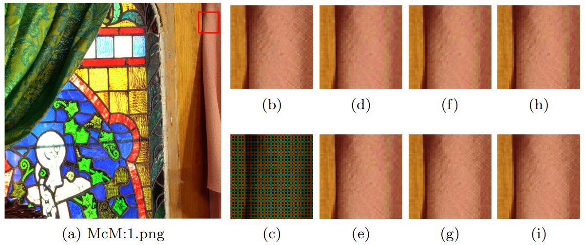

# RSTCANet
Residual Swin Transformer Channel Attention Network for Image Demosaicing

[Wenzhu Xing](https://scholar.google.com/citations?user=KvzPRbMAAAAJ&hl=en&oi=ao), [Karen Egiazarian](https://scholar.google.com/citations?user=PzvGG50AAAAJ&hl=en)

<hr />

> **Abstract:** *Image demosaicing is problem of interpolating full-resolution color images from raw sensor (color filter array) data. During last decade, deep neural networks have been widely used in image restoration, and in particular, in demosaicing, attaining significant performance improvement. In recent years, vision transformers have been designed and successfully used in various 
computer vision applications. One of the recent methods of image restoration based on a Swin Transformer (ST), SwinIR, demonstrates state-of-the-art performance with a smaller number of parameters than neural network-based methods. Inspired by the success of SwinIR, we propose in this paper a novel Swin Transformer-based network for image demosaicing, called RSTCANet. To extract image features, RSTCANet stacks several residual Swin Transformer Channel Attention blocks (RSTCAB), introducing the channel attention for each two successive ST blocks.
Extensive experiments demonstrate that RSTCANet outperforms state-of-the-art image demosaicing methods, and has a smaller number of parameters.*
<hr />

## Network Architecture

 

__The architecture of our proposed residual Swin Transformer Channel Attention network (RSTCANet). The network consists of three modules: the shallow feature extraction, the deep feature extraction, and the image reconstruction modules. The shallow feature extraction module is composed of a pixel shuffle layer and a vanilla linear embedding layer. For deep feature extraction, we propose residual Swin Transformer Channel Attention blocks (RSTCAB) to extract both hierarchical window based self-attention-aware features and vertical channel-attention-aware features. This module consists of K RSTCAB and one 3x3 convolutional layer. The shallow and deep features are first aggregated by a long skip connection before they fed into the image reconstruction module. The image reconstruction consists of the up-sampling layer and two 3x3 convolutional layers.__ 

__There are N Swin Transformer layers (STL) and N/2 channel attention blocks (CA), and one 3x3 convolutional layer in our proposed residual Swin Transformer Channel Attention block (RSTCAB). There is also a skip connection in the RSTCAB, guaranteeing that the RSTCAB will focus on the differences between the input and output images. For each two successive STL, the channel attention block generates the channel statistics with the input of two STLs and multiplies the produced attention with the output of two STLs. The N channel attention blocks in the same RSTCAB share parameters.__

## Architecture Variants

 

__The parameter settings of different model variants. C is the channel number. K and N denote the number of RSTCAB and the number of STL in one RSTCAB, respectively.__

## Code

1. Pretrained Models:
    1. [RSTCANet_B.pth](dm_model_zoo/RSTCANet_B.pth) (5.5 MB)
    2. [RSTCANet_S.pth](dm_model_zoo/RSTCANet_S.pth) (16.0 MB)
    3. [RSTCANet_L.pth](dm_model_zoo/RSTCANet_L.pth) (32.6 MB)

2. Test:
    ```bash
    python main_test_dm.py --model_name RSTCANet_B --testset_name urban100 --nc 72 --num_head 6 --N 6 --K 2
    ```
    ```bash
    python main_test_dm.py --model_name RSTCANet_S --testset_name urban100 --nc 96 --num_head 6 --N 6 --K 4
    ```
    ```bash
    python main_test_dm.py --model_name RSTCANet_L --testset_name urban100 --nc 128 --num_head 8 --N 8 --K 4
    ```

## Results on Image Demosaicing


## Resulting Images

__Visual results comparison of different demosaicing methods. (a) Ground-truth and selected area; (b) Ground-truth; (c) Mosaiced; (d) IRCNN; (e) RSTCANet-B; (f) DRUNet; (g) RSTCANet-S; (h) RNAN; (i) RSTCANet-L.__





